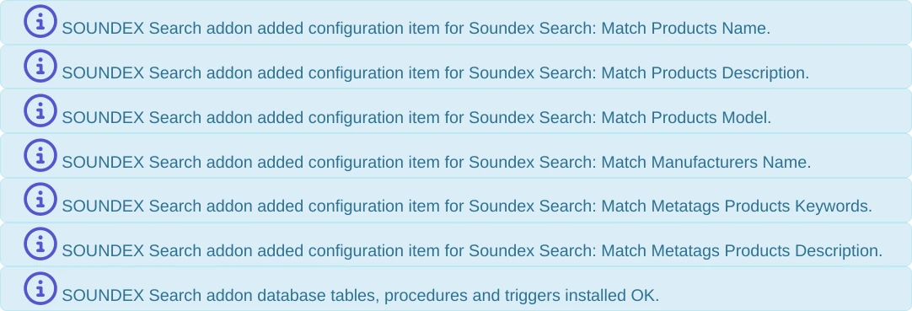
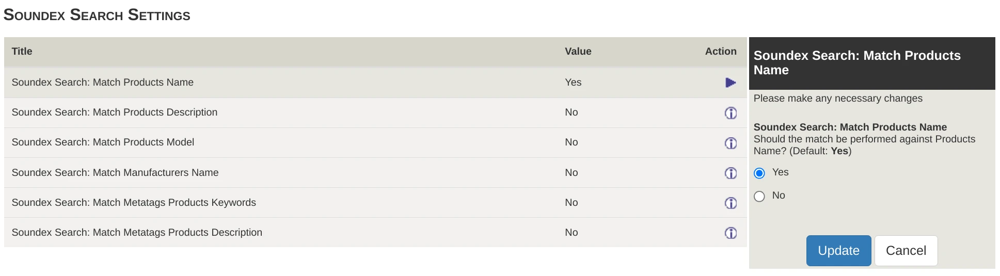

# Soundex Search Plugin for Zen Cart

## License

This software is distributed under the [GPL 3.0](gpl-3.0.md) license.

## Compatibility

| Addon Version | Zen Cart Version |
|---------------|------------------|
| v1.0.0 | Zen Cart 1.5.8 |
| v1.0.1 | Zen Cart 1.5.8 |

Minimum version of Zen Cart is 1.5.8, because of the extra data passed to the notifier hooks.  See "Earlier Zen Cart Versions" later.

# Introduction

This plugin adds the ability to match similar sounding words when performing a Product Search from the Zen Cart header.  For example, if you have a product called "Wonderfudge" but people sometimes accidentally type "Wanderfudge", they should get the expected product in the results even though the search string is not found in the product name.

Options are included to search against the commonly matched fields supported by Zen Cart:
- Product Name
- Product Description
- Manufacturer Name
- Meta Tag Title
- Meta Tag Description

There is no dedicated Admin page, the functionality is simply invoked when you use the site 'Search' function.

# Installation

## Prerequisites

*Please Note* you will need certain fairly high level privileges granted to your database user that's used to connect to the Zen Cart database.  This is *not* the same as your login user, or the user used to run your web site.  If you are on shared hosting and have little control over your database, this may mean you simply cannot run this addon.

You will need:
- CREATE TABLE - you probably already have this, as it's required to install Zen Cart.
- CREATE PROCEDURE - required for calculating the search values.
- CREATE TRIGGER - required for maintaining the search values as you edit your shop.

The Initialisation process built into this addon will test to see if you have suitable privileges before attempting to set itself up, see "First Time Initialisation" later.  However, if this fails, it's your responsibility to remove the addon files from your Zen Cart installation to make sure they don't attempt any further actions, which would fail because the initialisation could not complete.

Unzip the addon files into a temporary directory (for example, create a directory in your Downloads folder and delete it later), and prepare to copy them into your Zen Cart shop.

## Copying Files

There are zero file conflicts with core Zen Cart, so no files will be overwritten during installation.  You have most likely renamed your admin folder (as recommended in the Zen Cart installation guide).  Rename the `YOUR_ADMIN` folder to the name of your admin folder.

You should copy all files and subfolders from the Version directory of your choice into your Zen Cart shop filesystem, here we will assume the first release `1.0.0`.

For example:

    $ mv 1.0.0/YOUR_ADMIN 1.0.0/my_admin_name
    $ cp -r 1.0.0/* /path/to/shop/

If you are installing over sFTP, then drag the entire contents of the `1.0.0` folder into the root directory of your web site (next to `index.php` and `zc_plugins`);

## Earlier Zen Cart Versions

Before version 1.5.8, *two minor changes* are required to the core Zen Cart file `includes/modules/pages/search_result/header_php.php` file so that the addon is passed the required information to do its job.  First, make a backup copy of this file in case something goes wrong.  Then, open this file in an editor and look for this line:

    $zco_notifier->notify('NOTIFY_SEARCH_FROM_STRING');

Change it to:

    $zco_notifier->notify('NOTIFY_SEARCH_FROM_STRING', $from_str, $from_str);

Second, look for this line later in the file:

    $zco_notifier->notify('NOTIFY_SEARCH_WHERE_STRING');

Change it to:

    $zco_notifier->notify('NOTIFY_SEARCH_WHERE_STRING', $keywords, $where_str, $keyword_search_fields);

If you cannot find these two lines, or something goes wrong trying to search, seek advice or support.

# First Time Initialisation

The first time you install the addon, you should visit the admin site of your shop at least once.  An initialisation routine will run, and if it detects that the core lookup table does not exist, it will attempt to create the required database entities for the addon to function.

*Until this is done, your customer facing shop site may not function correctly* because attempting to search, or possibly use other addons that trigger parts of this addon, will fail because the database entities it requires do not exist.

If you need to re-run the initialisation you can manually drop the core lookup table in phpMyAdmin or the "Tools->Install SQL Patches" Zen Cart admin page with the command: `DROP TABLE soundex_lookup;` then revisit any admin page.  Note that this will only attempt to re-create entities required by the addon, if you want to clear the database of addon entities first then run the uninstall script described later, then re-run the initialisation.

## Example first time initialisation

When visiting your admin site for the first time, you should see a series of 'Success' messages in the notification area at the top of the page.

If you do not see this, or get any other weird behaviour, please see "Troubleshooting" later.

# Configuration

As you will see in the Initialisation section, several configuration entries are created by this addon.  These are found in the admin "Configuration" menu under "Soundex Search Settings".

For simplicity, everything except Product Name matching defaults to "off".

Note that when a search is performed, there is a `Search in Description?` checkbox provided that the user can deselect.  If this is turned off, then no Product Description match will be attempted, even if you have set the "Product Description" config option to "Yes".  Similarly, the Configuration option `Include meta-tags in product search?` under "Configuration->My Store" disabled matching against meta tags.

## Troubleshooting

### Blank Admin Page

If you get a blank admin page, there has probably been a low level error trying to run the initialisation and your site is configured to not display error messages as a security precaution.  Check the `logs` folder in your site's root directory, or install the "View Logs" addon, to check the latest log files for relevant error messages.

### Insufficient Privileges

If your user doesn't have suitable permissions to create the database entities required by Soundex Search, you should see a sensible error message in your admin header like this:

In this case, you must ask your system admin to grant your Zen Cart database user (in this example, `myuser`@`localhost`) privileges, or you will not be able to run the addon.  Especially on shared hosting, you may find your username only has basic priviliges to query data or make basic modifications to the database structure.  On top of these more priviliges, these extra priviliges required by this addon will be something like: `CREATE ROUTINE`, `ALTER ROUTINE`, `EXECUTE`, `TRIGGER`.

# Uninstalling

If you wish to remove this addon from your shop, you can delete its files from your Zen Cart filesystem, but it will have left some database entities in your system.  These should not cause any problems, but there's no point leaving them there.  You should run the `soundex_search_uninstall.php` script as a Zen Cart Superuser, but first you should remove the `init_soundex_search.php` script and its related config file, otherwise it is likely to automatically re-install the addon as soon as you have removed it.

1. remove or rename the `YOUR_ADMIN/includes/init_includes/init_soundex_search.php` and `YOUR_ADMIN/includes/auto_loaders/config.soundex_search.php` files.  You can simply rename them and add 'xxx' to the start of their filenames.  *Leave the rest of the files in place, as they are required for the next step*
2. run the uninstall script by entering it into your web browser as if it were an admin page, for example: `https://my-shop.com/YOUR_ADMIN/index.php?cmd=soundex_search_uninstall`

You should see a series of 'success' messages in the header.  Once everything is cleaned up, it is safe to delete the files installed when you copied the files from the distribution zip file.  At the time of writing, these are:

- includes/classes/observers/auto.soundex_search_observer.php
- includes/extra_datafiles/soundex_search_datafiles.php
- includes/languages/english/extra_definitions/lang.soundex_search.php
- YOUR_ADMIN/includes/init_includes/init_soundex_search.php
- YOUR_ADMIN/includes/auto_loaders/config.soundex_search.php
- YOUR_ADMIN/includes/languages/english/extra_definitions/lang.soundex_search.php
- YOUR_ADMIN/includes/functions/extra_functions/soundex_search.php
- YOUR_ADMIN/includes/extra_datafiles/soundex_search_datafiles.php
- YOUR_ADMIN/soundex_search_uninstall.php

If you see a security message such as "Sorry, your security clearance does not allow you to access this resource." then you are trying to run the uninstaller as a non-superuser Zen Cart user.